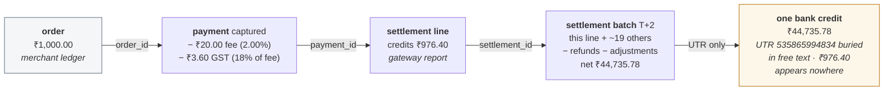
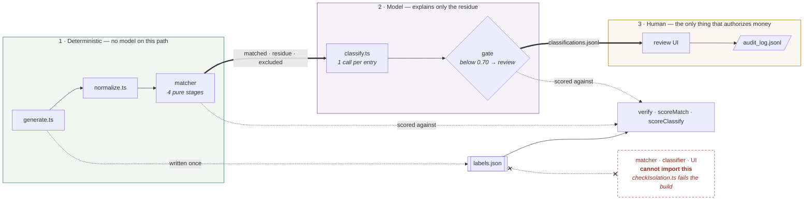
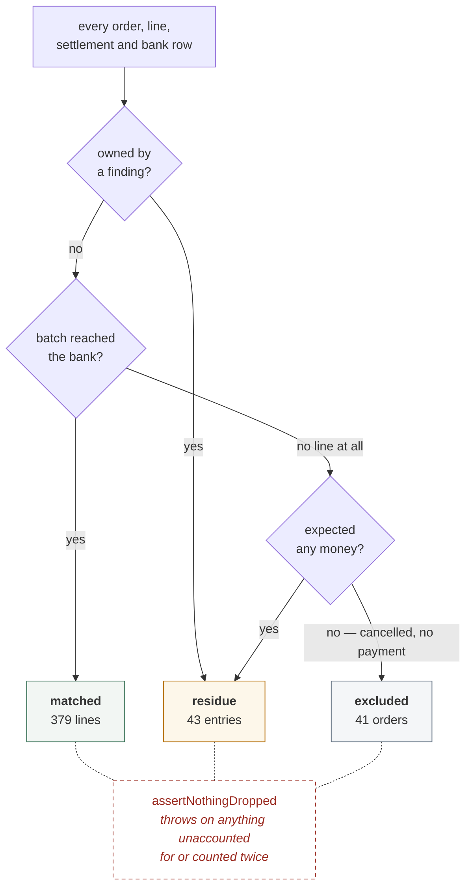
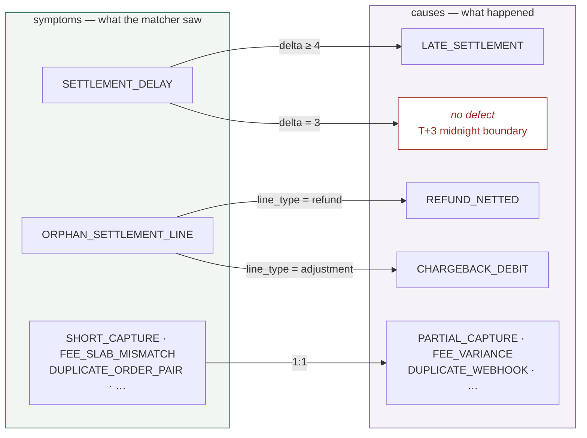

# RecoLoop — Architecture

## 1. Problem

Three systems hold a record of the same money and none of them agree, by
construction. The merchant's order ledger records gross intent; the gateway's
settlement report records net-of-fee payouts with refunds and adjustments from
unrelated cycles netted in; the bank records one credit for an entire day's batch
and never itemises a transaction.



Each arrow is a join, and they get progressively weaker: two explicit columns, a
grouping, and then a 12-digit string inside a description field matched against a
reconstructed batch total under date tolerance. Reconciliation is proving the
₹1,000 the merchant expected and that batch credit are the same money.

## 2. Design principle

**The LLM never controls the matching path.** Financial relationships are
explicit, repeatable, and auditable by a deterministic engine first. The model is
confined to explaining what the engine could not resolve, and even there, human
approval — not model confidence — is what authorizes an entry that moves money.

Everything below is evidence for that sentence.

## 3. Pipeline



`labels.json` is written once by the generator and read only by the three scorers.
No edge runs from it to the matcher, the classifier, or the UI — and §9 explains
why that is a build-time guarantee rather than a promise.

## 4. Data foundation

500 synthetic orders over a 30-day window, every amount an integer number of
paise, with **40 seeded defects across 9 causal classes** (taxonomy in the
[README](README.md)). Each defect's `true_cause` lives only in `labels.json`.

Synthetic-with-ground-truth beats a handful of real examples for one reason: it
lets the system be *scored*. Precision and recall against known answers are
arguments; a demo that looks right is an anecdote. It also means the pipeline can
be stress-tested — **42 seeds, order counts from 60 to 5,000**, all holding 40/40.

The generator also injects *dirt*, deliberately not a defect: dates alternate
between `DD/MM/YYYY` and `YYYY-MM-DD`, ~8% of id cells carry stray whitespace and
mixed case, and bank amounts arrive as comma-grouped rupee strings like
`"1,24,530.00"`. That makes normalization real engineering — a matcher that skips
it produces false positives unrelated to the 40 real breaks.

### The contract

The four joins are the arrows in §1; the UTR is the only one that is not an
explicit column, and it appears in three different description shapes. Two
invariants hold exactly, and no defect in the taxonomy perturbs either:

```
settlement.net_amount_paise = Σ line.credit_paise − Σ line.debit_paise
fee = round(amount * bp / 10_000)      tax = round(fee * 18 / 100)
```

A payment line credits `amount − fee − tax`; refunds and adjustments debit in
full. Every `processed` settlement produces exactly one bank credit equal to its
net; every `on_hold` settlement produces none. Fee rates are basis points
(`upi 0, card 200, netbanking 180, wallet 220`), so money is integer paise end to
end — the only rupees-with-decimals are the bank statement's *rendering*, parsed
back as a string, never through `parseFloat`.

### Two stated assumptions

**1. The settlement report carries `order_id` and `method`.** Razorpay's recon
report carries `entity_id`; `payment_id` here is faithful to that. The other two
are additions, encoding the assumption that *the merchant's own order system
enriches the recon feed at ingestion time* — a normal thing to build, but an
assumption about the merchant's stack, not a property of the gateway. It does not
make matching easier where it counts; it makes `PARTIAL_CAPTURE`,
`SILENT_UPI_FAIL` and `FEE_VARIANCE` *detectable*. Strip those columns and three
defect classes become undetectable in principle, making the dataset unscoreable
rather than harder.

**2. Debits are bounded so a batch is never a net debit.** Real batches never are,
but an ₹85,000 refund against a day whose gross credits total ~₹30,000 would make
one. Debits are capped at half the median daily gross, and anything a batch cannot
absorb carries forward once — what a gateway does when a day's refunds outrun its
captures. The bound exists because its absence was a live bug (defect 2).

### The verifier restates the contract independently

`scripts/verify.ts` reads the dataset back as a consumer would and asserts ten
invariants, exiting non-zero on any failure. It **imports no business logic from
the generator**, only parsing helpers: every rate and constant is restated from
the documented contract, so a generator bug cannot hide inside a helper both
sides call. Not hypothetical — an earlier version imported the very constant it was
meant to check (defect 4). Three of the ten carry the coverage story; the rest
check label integrity, leak, ordering, running balance and integer money.

```
PASS  settlement net == sum(credit) - sum(debit)           30/30 settlements balance exactly, incl. all 25 carrying an injected defect
PASS  net reconstructs from published fee slabs            26 settlement(s) reconstruct exactly, 4 deviate by exactly the injected delta (-269 paise total)
PASS  every defect manifests exactly as its taxonomy says  40/40 labels recovered from the CSVs alone, 0 false positives
```

Between them every settlement is checked — for exact correctness or for the exact
expected deviation — and every injected defect is proven present and findable from
the CSVs alone.

## 5. Deterministic matcher

Four pure stages, `(normalized records) -> findings`, with all I/O confined to the
orchestrator:

1. **order ↔ payment** — join on `order_id`; duplicates within 90s treated as
   candidates for the *same* payment, never silently collapsed.
2. **payment / refund ↔ line** — resolve each line to the merchant's records;
   compare captured against ordered, fee against the published slab.
3. **settlement ↔ bank credit** — group by `settlement_id`, reconstruct the batch
   net, tie it to one bank credit through the UTR, ±1 paise.
4. **date tolerance** — compute the day-delta and carry it forward as evidence.
   T+2 is never a hard match/no-match boundary.

### The twelve finding codes

Stages emit *findings*, not verdicts. Each takes ownership of the entities it
fired on, and ownership is what the partition is defined over.

| code | fires on |
| --- | --- |
| `DUPLICATE_ORDER_PAIR` | two order rows, same amount, ≤90s apart |
| `ORDER_WITHOUT_SETTLEMENT` | a `paid` order with no settlement line |
| `ORPHAN_SETTLEMENT_LINE` | a line with no counterpart in the merchant's records |
| `SHORT_CAPTURE` | captured amount below the order amount |
| `SETTLEMENT_DELAY` | day-delta above T+2, carrying the exact delta |
| `SETTLEMENT_WITHOUT_BANK_CREDIT` | processed batch, no bank row for its UTR |
| `BANK_CREDIT_WITHOUT_SETTLEMENT` | bank credit whose UTR is in no settlement |
| `NET_MISMATCH` | batch net vs bank credit outside ±1 paise |
| `UNEXPECTED_BANK_CREDIT_ON_HOLD` | held batch that nonetheless got paid |
| **`FEE_SLAB_MISMATCH`** | fee/tax off the published slab |
| **`SETTLEMENT_ON_HOLD`** | held batch: money owed that never arrived |
| **`ORDER_STATUS_CONTRADICTION`** | settled payment against an order still `pending` |

`NET_MISMATCH`, `SETTLEMENT_WITHOUT_BANK_CREDIT` and
`UNEXPECTED_BANK_CREDIT_ON_HOLD` never fire here, which is correct rather than
dead code: the report is internally consistent by construction, so no defect can
make a batch net disagree with its own lines.

**The three bolded codes are additions, and without them capture would have been
27/40.** The specified net check compares a batch against its own lines, which is
tautological, so fee variance leaves no trace — `FEE_SLAB_MISMATCH` catches it via
the published slabs instead. A held batch with no bank row was treated as
*expected*, so it would have been auto-matched: money owed and never received,
marked `verified: true` (`SETTLEMENT_ON_HOLD`). And a `pending` order *with* a
settlement line is the opposite condition to `ORDER_WITHOUT_SETTLEMENT`
(`ORDER_STATUS_CONTRADICTION`). That is what a taxonomy tested against real
failure modes looks like versus one assumed correct on paper.

### The partition invariant



It was not theory. It caught two bugs that seed 42 never exposed and that only
appeared across a 42-seed sweep: clean **refund lines went unaccounted** when their
parent order was tainted for an unrelated reason, and **settlements that reconciled
perfectly but had no surviving clean line vanished entirely**. Forty lines of
assertion; two bugs neither the type checker nor a passing scorer would surface.

`excluded` is a third bucket on purpose: a `cancelled` order with no payment *is*
reconciled — it expected no money and saw none, and filing those 41 rows as
exceptions would wreck the match rate. Ownership keeps it well-defined: only a
**payment** line's matched record claims its order, and a reconciled batch is
matched even when individual lines are disputed.

### Results

| | |
|---|---|
| defect capture | **40/40** |
| match rate by count | **89.81%** |
| match rate by value | **73.66%** |

The value rate is lower for a structural reason: a few residue entries own a
great deal of money. An on-hold settlement owns its **entire batch**, and the two
unexplained credits are single large rows. Five entries carry 70% of residue
value; the four on-hold batches alone carry 31%. It is not that defective
*transactions* are larger — a few defects implicate whole batches. That
concentration is the argument for scrutiny: the exceptions are where the money is.

`scoreMatch.ts` prints a full finding-type × true-cause cross-tab, credited per
finding over the entities it fired on. Every type is perfectly precise except one:
`SETTLEMENT_DELAY` fires on 7 true `LATE_SETTLEMENT` and 7 pieces of boundary
noise (§6) — which is why stage 4 hands over a raw day-delta, not a verdict.

**Known precision limit.** The duplicate heuristic (identical amount, ≤90s apart)
degrades with order density: at `--orders 5000` it produces 20
`DUPLICATE_ORDER_PAIR` findings for 12 real defects. Capture stays 120/120, so the
cost is precision, not recall — the right direction for a stage feeding a
classifier.

**Output departures from the spec.** `excluded` is a third bucket, per above.
`entities` uses arrays rather than singular keys, because a duplicate pair owns
two orders and a held batch owns twenty lines. Each residue entry carries a
`findings` array — code plus exact entity ids — so the cross-tab is computed per
finding; without it an entry with two findings would be double-counted.

## 6. Classifier

One API call per residue entry, temperature 0, no batching — cross-contamination
between cases is a real failure mode, and per-entry calls keep retries and
confidence attributable.

Structured output is **forced**, not requested: tool-use for Anthropic, native
`responseSchema` for Gemini, both derived from a **single Zod schema**, so the two
paths cannot drift. Where Gemini's OpenAPI-subset dialect differs, an adapter
flattens Zod's `anyOf: [X, null]` to `nullable: true` and strips unsupported
keywords — nothing is lost, since Zod remains the enforcement layer.

**Provider abstraction.** Three transports behind one interface: `anthropic`,
`gemini`, and a deterministic `rules` baseline. Adding Gemini required **zero
changes** to the matcher, prompt, output contract, gate, scorer or taxonomy — only
a transport and config wiring, with shared backoff *extracted* rather than
duplicated: the difference between a bounded component and an API call braided
through orchestration logic.

### Robustness

| behaviour | how it is handled |
| --- | --- |
| schema violation | retry **once** with the validation error fed back; second failure falls through to a human-review record. The batch never crashes |
| transport failure | caught per entry, recorded, batch continues |
| 429 / 5xx | exponential backoff honouring `retry-after`, up to 6 attempts |
| crash mid-run | results append one line at a time, so a crash on case 40 keeps 39; a torn line is tolerated on read and compacted away before the next append (defect 10) |
| rerun | entries already present are skipped — **except** `transport_failure` rows, where the model never saw the case (defect 11) |
| rerun, different provider | refused with a non-zero exit; resume is keyed on `residue_id` and would otherwise report the previous provider's numbers as this one's (defect 19) |

### A causal taxonomy, not a symptomatic one

The nine classes name what happened in the world, not what the matcher observed —
the finding codes *already are* the symptom, and a model re-labelling symptoms
would be decorative. The mapping is deliberately not 1:1, and resolving that
ambiguity is the entire reason the layer exists.



The 1:1 arrow is the easy half — a lookup table gets it, which is what the `rules`
baseline is and why it also scores 37/40. The forks are the work: a delay of
exactly 3 days is almost always a capture that crossed midnight relative to its
order, not a genuine T+5 payout, because `captured_at` is published nowhere and
the delta must be measured from the order's `created_at`.

**`INSUFFICIENT_EVIDENCE` is rewarded, not tolerated.** The prompt states plainly
that a confident wrong cause is far more expensive than an honest "I cannot tell",
because a high-confidence answer can be auto-approved and **booked without a human
reading it**. It works: **6 of 6 matcher false positives were correctly declined**
at 0.9–1.0 confidence — the model is *certain* they are not defects.

**Two structural facts the score depends on.** The ceiling is 37/40: three entries
bundle two real defects each and one prediction cannot name both, so
`scoreClassify.ts` prints the ceiling rather than letting the headline look like
model failure. And six entries carry no defect at all — the T+3 false positives —
scored separately, because "does it know the matcher was wrong" is a different
question from "can it name a real defect".

## 7. The confidence gate — and what actually happened

**The design.** Confidence below 0.70 forces `requires_human_review` regardless of
predicted cause — a low-confidence label is not a proposal, it is a "look at this"
flag. **The result**, both runs complete at 43/43, scored by the same script:

| | rules baseline | gemini-3.1-flash-lite (live) |
|---|---|---|
| defects correct | 37/40 (ceiling) | 37/40 (ceiling) |
| matcher false positives declined | 6/6 | 6/6 |
| sent to human review | **0** | **16** |
| auto-approved accuracy | 92.5% | 93.1% |
| unreviewed ₹ exposure | **₹2,21,709.87** | **₹40,741.13** |
| wrong auto-approvals | 0 | 0 |

Both hit the same headline, which is the point: on unambiguous cases a lookup
table is already correct. The model earns its place by cutting unreviewed
exposure **82%** at no cost in accuracy. Three findings matter more than that.

**1. The 0.70 threshold never fired.** Zero of the 16 review flags came from the
gate; Gemini's confidence never dropped below 0.90 across all 43 cases, including
the six where the right answer is "not a defect at all". Every routing decision
was the model setting `requires_human_review` itself. The gate is inert against
this model — a backstop for a differently calibrated one, not the mechanism doing
the work.

**2. It routes on financial consequence, not epistemic doubt.** Reviewed cases are
those whose proposed entry moves money the model cannot verify — `PARTIAL_CAPTURE`
shortfalls, `UNEXPLAINED` credits, `SILENT_UPI_FAIL` corrections. Cases whose
action is "no action — timing only" are auto-approved even at confidence 1.00.
Defensible, and the prompt asks for it, but not the gate the design assumed.

**3. The bundled-defect blind spot.** Three entries each contain two real defects
— a duplicated order row whose settled twin sits inside an on-hold batch. **Two
of the three were auto-approved as `ON_HOLD` at confidence 1.00.**

The interesting part is where the second defect went. The model did not miss it:
in all three cases it named the duplicate pair in its reasoning, once by the
literal cause name (*"While there is a DUPLICATE_WEBHOOK between … the ON_HOLD
status is a settlement-level cause that takes precedence"*). Then
`predicted_cause` — a single enum — kept one and discarded the other at the schema
boundary, and everything downstream scores, routes and books on the survivor
alone. The reported `Rs 0.00 at risk` is true under an entry-level definition of
"wrong" and still understates this. It is a **contract defect, not a model
defect** — the information was produced, then thrown away by the shape of the
output, and no prompt recovers a second label from a schema with room for one.
The harness measures what the fix would recover: three defects, 37/40 → 40/40.

## 8. Review UI and audit log

Three panels, client-side case switching so the queue is instant.

- **Queue** — in-review first, then auto-approved, ties broken by proposed value
  descending: the order the work actually arrives in, biggest money first inside
  the bucket that needs a human.
- **Evidence ledger** — the matcher's evidence as a ledger, labels left and figures
  hard-aligned right, then the entities, then anything the matcher **considered and
  ruled out** in dashed borders, so a near-miss is never mistaken for the match.
- **Decision bar** — approve, reject or reclassify, shown only while undecided.

**The banner distinction.** Each case states whether it is here because *the model
flagged it itself* or because it fell *below the 0.70 gate*. Collapsing those into
"needs review" would have hidden finding #1 — that the gate never fires is only
visible if the UI refuses to conflate the two.

**The audit log** is append-only JSONL: every action appends one line, nothing is
rewritten, and deciding a case twice leaves both lines in order. The route
**re-reads the case server-side before writing**, so the log records what the model
actually said rather than what a client claimed. JSONL over Supabase because there
is no schema to migrate, no auth to configure, and no second service to keep alive
for one growing append-only list.

## 9. Isolation as a build-time guarantee

`checkIsolation.ts` walks the static import graph from every entry point on the
consuming side — `normalize.ts`, `match/run.ts`, `classify/run.ts`, the prompt
builder, the rules and Gemini providers, the UI data module and route handler,
and both CLIs — and fails `npm run build` if any can reach `labels.ts`,
`labels.json`, or the defect taxonomy. Ten entry points, 21 modules reachable,
none able to see the answers. (The Anthropic provider is reachable from
`classify/run.ts` and scanned as part of that graph.) The generator is
deliberately *not* scanned: it writes `labels.json`, so it is the one component
that must know the ground truth.

**Negative control.** Adding a labels import to a matcher file, a classifier file
and a UI file each fails the build with exit code 1 — not merely a warning. (The
guard also had to be taught to strip comments, because its own documentation
saying *"never reads labels.json"* matched its own rule.) That makes "the model
never saw the answers" a **provable property of the codebase** rather than a claim
about how it happened to be run.

## 10. What broke, and what that tells you

Nineteen defects are logged in [FAILURES.md](FAILURES.md) with symptom, root
cause, fix, and what caught each. Four are worth reading here.

**Settlement rebalancer infinite loop.** `generate.ts --seed 99` hung — oversized
debits were pushed to an adjacent day, the mover could go either direction, so a
debit too large for both neighbours bounced forever. Replaced with a forward-only
carry sweep. One seed in five could not generate at all.

**Refund exceeding daily settlement capacity.** Immediately behind it: amounts run
to ₹85,000, but 500 orders over 30 days is ~₹30,000 of gross credit per day, so
refunding a top-decile payment exceeds a day's takings. A modelling defect, not a
coding one — the distribution and the batching rule were individually reasonable
and jointly impossible.

**The bundled-defect blind spot** (§7, finding 3) is a different kind of finding:
not an engineering bug but the system surfacing its own limitation, measured
rather than worked around, and the only entry left deliberately unfixed.

**Resume skipped a run it had never done.** Found last, by cloning the finished
public repo and running its own README. `--provider rules` reported all 43 cases
"already classified" and exited 0, because resume was keyed on `residue_id` and
the repo ships a completed Gemini run under that filename — so the documented
offline path produced nothing while looking like it succeeded. Resume now
compares provider and model and refuses to mix. The generalisation beats the fix:
*the artefacts a repo ships are part of its behaviour*, and a path only exercised
on the machine that already ran it is untested.

The closing table in `FAILURES.md` is the argument: type checking found none of
the nineteen, a passing scorer found none of the first seventeen, and the
highest-yield mechanisms were the cheapest — run the code over 42 seeds instead of
one, assert that nothing disappears, clone the repo and run its own instructions.

## 11. Stack, and why

| | |
|---|---|
| Next.js 15 (App Router) + TypeScript `strict`, `tsx` | one framework, one deploy target, scripts run with no build step |
| Hand-written CSS with custom properties | no Tailwind; see below |
| Zod + `@anthropic-ai/sdk` + `@google/genai` | one schema, two model transports, contracts derived from it |
| Supabase | available, deliberately unused |

**One language end to end.** The matching core is deterministic arithmetic and
joins — integer paise, grouping, date comparisons — and nothing in it wants NumPy.
A Python service would add a second runtime, a second deploy target and an
inter-process boundary that can fail live on camera, in exchange for nothing.

**Two honest notes.** The UI is hand-written CSS, not Tailwind: a dense finance-ops
tool with hard-aligned tabular figures is more precisely expressed in ~600 lines of
CSS than utility classes, and keeps the bundle at 4.4 kB. And **Supabase is not a
dependency** — scoped for audit-log persistence, JSONL shipped instead (§8).

## 12. What's not built

- **Multi-cause labeling.** The structural fix for §7's blind spot. A residue
  entry can carry two real defects; the schema has room for one. The scoring
  harness already measures what it would recover: three defects, 37/40 → 40/40.
- **Multi-seed switching and shared persistence.** The seed is a constant and the
  audit log is one machine's file. The route already takes a `seed` parameter, so
  the first is wiring; a second reviewer would need the log behind a service.
- **Threshold sweeping.** `CONFIDENCE_THRESHOLD` sits alone in `config.ts` to make
  a sweep trivial, but finding #1 means it changes nothing below 0.90 here — the
  interesting experiment is a differently calibrated model, not a different number.
