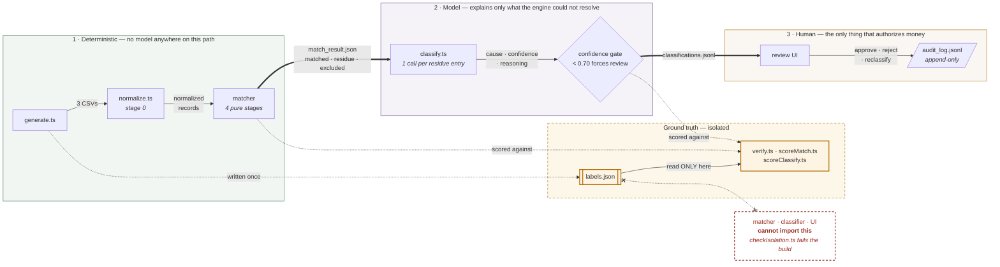

# RecoLoop — Architecture

## 1. Problem

Three systems hold a record of the same money and none of them agree, by
construction. A merchant's order ledger records gross intent; the gateway's
settlement report records net-of-fee payouts with refunds and adjustments from
unrelated cycles netted in; the bank records one credit for an entire day's
batch and never itemises a transaction.

A ₹1,000 card order settles like this: the gateway charges 2.00% — ₹20.00 — plus
18% GST on that fee — ₹3.60 — and credits **₹976.40**. Three of those four
numbers appear in no single file, and the bank statement does not show ₹976.40
at all: it shows one credit for the whole day's net, with a 12-digit UTR buried
in free text as the only handle. Reconciliation is the work of proving that the
₹1,000 the merchant expected and the batch credit the bank sent are the same
money.

## 2. Design principle

**The LLM never controls the matching path.** Financial relationships are
explicit, repeatable, and auditable by a deterministic engine first. The model is
confined to explaining what the engine could not resolve, and even there, human
approval — not model confidence — is what authorizes an entry that moves money.

Everything below is evidence for that sentence.

## 3. Pipeline

What crosses each boundary: **CSVs** → normalized records → **matched / residue /
excluded** → `classifications.jsonl` → gated verdict → reviewer decision →
`audit_log.jsonl`.

The dashed lane is the isolation boundary. `labels.json` is written once by the
generator and read only by the three scorers. No edge runs from it to the
matcher, the classifier, or the UI — and section 9 explains why that is a
build-time guarantee rather than a promise.

## 4. Data foundation

500 synthetic orders over a 30-day window, every amount an integer number of
paise, with **40 seeded defects across 9 causal classes**. Each defect's
`true_cause` lives only in `labels.json`.

Synthetic-with-ground-truth beats a handful of real examples for one reason: it
lets the system be *scored*. Precision and recall against known answers are
arguments; a demo that looks right is an anecdote. And because the answers exist,
the pipeline can be stress-tested rather than demonstrated — **42 seeds, and
order counts from 60 to 5,000**, all holding 40/40 defect capture. Nothing here
is tuned to one lucky seed.

The generator also injects *dirt*, which is deliberately not the same thing as a
defect: bank dates alternate between `DD/MM/YYYY` and `YYYY-MM-DD`, roughly 8% of
ID cells carry stray whitespace and mixed case, and bank amounts arrive as
comma-grouped rupee strings like `"1,24,530.00"`. That is what makes
normalization a real engineering problem instead of a formality — a matcher that
skips it produces false positives that have nothing to do with the 40 real
breaks.

## 5. Deterministic matcher

Four pure stages, `(normalized records) -> findings`, with all I/O confined to
the orchestrator:

1. **order ↔ payment** — join on `order_id`; duplicates within 90 seconds treated
   as candidates for the *same* payment, never silently collapsed.
2. **payment / refund ↔ settlement line** — resolve each line to the merchant's
   own records; compare captured against ordered, and fee against the published
   slab.
3. **settlement group ↔ bank credit** — group by `settlement_id`, reconstruct the
   batch net, tie it to a single bank credit through the UTR with ±1 paise
   tolerance.
4. **date tolerance** — compute the actual settlement day-delta and carry it
   forward as evidence. T+2 is never a hard match/no-match boundary.

### The partition invariant

Every order, settlement line, settlement and bank row lands in **exactly one** of
`matched`, a residue entry, or `excluded`. `assertNothingDropped` checks it on
every run and throws otherwise.

It was not theory. It caught two real bugs that seed 42 never exposed and that
only appeared across a 42-seed sweep: clean **refund lines went unaccounted**
when their parent order happened to be tainted for an unrelated reason, and
**settlements that reconciled perfectly but had no surviving clean line vanished
entirely**. Roughly forty lines of assertion, two bugs neither the type checker
nor a passing scorer would have surfaced.

### Results

| | |
|---|---|
| defect capture | **40/40** |
| match rate by count | **89.81%** |
| match rate by value | **73.66%** |

The value rate is lower than the count rate, and the reason is structural rather
than statistical: a handful of residue entries each own a great deal of money. An
on-hold settlement owns its **entire batch** — every line in it — and the two
unexplained bank credits are single large rows. Five entries carry 70% of all
residue value, and the four on-hold batches alone carry 31%. It is not that
defective *transactions* are individually larger; it is that a few defects
implicate whole batches. That concentration is itself the argument for scrutiny —
the exceptions are where the money is.

### Three finding codes the original spec could not fire

Built exactly to the specified taxonomy, capture would have been **27/40**. Three
defect classes had no code that could ever trigger:

- **`FEE_SLAB_MISMATCH`** — the specified net check compares a batch against its
  own lines, which is tautological. Fee variance leaves no trace in it. The
  invariant it *does* break is reconstruction from the published slabs.
- **`SETTLEMENT_ON_HOLD`** — the spec treated a held batch with no bank row as
  *expected*, so it would have been auto-matched: money the merchant is owed and
  never received, marked `verified: true`.
- **`ORDER_STATUS_CONTRADICTION`** — a `pending` order *with* a settlement line is
  the opposite condition to `ORDER_WITHOUT_SETTLEMENT`.

This is what a taxonomy tested against real failure modes looks like versus one
assumed correct on paper.

## 6. Classifier

One API call per residue entry, temperature 0, no batching — cross-contamination
between cases is a real failure mode, and per-entry calls keep retries and
confidence cleanly attributable.

Structured output is **forced**, not requested: tool-use for Anthropic, native
`responseSchema` for Gemini. Both are derived from a **single Zod schema**, so the
two paths cannot drift. Where Gemini's OpenAPI-subset dialect differs, a
documented adapter flattens Zod's `anyOf: [X, null]` nullability to
`nullable: true` and strips keywords Gemini does not support. Nothing is lost:
`responseSchema` only guides generation, while Zod remains the enforcement layer
and still triggers the one-shot repair retry.

### Provider abstraction

Three transports behind one interface: `anthropic`, `gemini`, and a deterministic
`rules` baseline. Adding Gemini required **zero changes** to the matcher, the
prompt content, the output contract, the confidence gate, the scorer, or the
taxonomy. The only new code was a transport implementation and the config wiring
to select it; shared backoff was *extracted* rather than duplicated. That is the
difference between a bounded, well-typed component and an API call braided
through orchestration logic.

### A causal taxonomy, not a symptomatic one

The nine classes name what happened in the world — `LATE_SETTLEMENT`,
`REFUND_NETTED`, `PARTIAL_CAPTURE` — not what the matcher observed. The reason is
simple: the matcher's finding codes *already are* the symptom. A model that
re-labelled symptoms would be decorative. The mapping is deliberately not 1:1 —
`SETTLEMENT_DELAY` is a genuinely late payout or harmless midnight boundary
noise; `ORPHAN_SETTLEMENT_LINE` is a prior-cycle refund or a chargeback — and
resolving that ambiguity is the entire reason the layer exists.

### INSUFFICIENT_EVIDENCE is rewarded, not tolerated

The system prompt states plainly that a confident wrong cause is far more
expensive than an honest "I cannot tell", because a high-confidence answer can be
auto-approved and **booked without a human reading it**. It works: **6 of 6
matcher false positives were correctly declined**, at 0.9–1.0 confidence. The
model recognises "this is not a defect" and is *certain* about it.

## 7. The confidence gate — and what actually happened

**The design.** Confidence below 0.70 forces `requires_human_review` regardless
of the predicted cause. A low-confidence label is not a proposal; it is a "look
at this" flag.

**The measured result**, both runs complete at 43/43 entries, scored by the same
provider-agnostic script:

| | rules baseline | gemini-3.1-flash-lite (live) |
|---|---|---|
| defects correct | 37/40 (ceiling) | 37/40 (ceiling) |
| matcher false positives declined | 6/6 | 6/6 |
| sent to human review | **0** | **16** |
| auto-approved accuracy | 92.5% | 93.1% |
| unreviewed ₹ exposure | **₹2,21,709.87** | **₹40,741.13** |
| wrong auto-approvals | 0 | 0 |

Both hit the same headline, which is the point: on unambiguous cases a lookup
table is already correct. The model earns its place by cutting unreviewed
financial exposure **82%** at no cost in accuracy. Three findings matter more
than the headline.

**1. The 0.70 threshold never fired.** Zero of the 16 review flags came from the
gate. Gemini's confidence never dropped below 0.90 across all 43 cases —
including the six where the correct answer is "this is not a defect at all".
Every routing decision was the model setting `requires_human_review` itself. The
gate is inert against this model; a threshold sweep changes nothing below 0.90.
It is a backstop for a differently calibrated model, not the mechanism doing the
work here.

**2. It routes on financial consequence, not epistemic doubt.** Reviewed cases
are those whose proposed entry moves money the model cannot verify —
`PARTIAL_CAPTURE` shortfalls, `UNEXPLAINED` credits, `SILENT_UPI_FAIL`
corrections. Cases whose action is "no action — timing only" are auto-approved
even at confidence 1.00. That is a defensible policy, and the prompt does ask for
it, but it is not the confidence-based gate the design assumed.

**3. The bundled-defect blind spot.** Three residue entries each contain two real
defects — a duplicated order row whose settled twin sits inside an on-hold batch.
**Two of the three were auto-approved as `ON_HOLD` at confidence 1.00.** The
model named the dominant cause correctly and silently dropped the second, with
nothing anywhere in the output indicating a second defect was present. The
reported `₹0.00 at risk` is true under an entry-level definition of "wrong" and
still understates this.

This is the honest ceiling of a one-label-per-case design, not a prompting
failure. Three defects are unreachable by construction, which is why 37/40 — not
40/40 — is the maximum any model can score here. **The fix is structural: allow a
case to carry more than one cause.** A better prompt cannot recover a second
label from a schema that has room for one.

## 8. Review UI and audit log

Three panels on one page, client-side case switching so the queue is instant.

- **Queue** — in-review first, then auto-approved, ties broken by proposed value
  descending. That is the order the work actually arrives in: biggest money
  first, inside the bucket that needs a human.
- **Evidence ledger** — the matcher's computed evidence rendered as a ledger,
  label left and figure hard-aligned right in tabular figures, then the entities
  involved, then anything the matcher **considered and ruled out** in dashed
  borders so a near-miss is never mistaken for the match.
- **Decision bar** — approve, reject, or reclassify, shown only while a case is
  undecided.

**The banner distinction.** Each case states whether it is here because *the
model flagged it itself* or because it fell *below the 0.70 gate*. Collapsing
those two into "needs review" would have hidden finding #1 entirely — the fact
that the gate never fires is only visible if the UI refuses to conflate the two
sources.

**The audit log** is append-only JSONL. Every action appends one line and nothing
is ever rewritten; deciding the same case twice leaves both lines in order. The
route **re-reads the case server-side before writing**, so the log records what
the model actually said rather than what a client claimed. File-based JSONL over
Supabase here because there is no schema to migrate, no auth to configure, and no
second service to keep alive for what is, structurally, one growing append-only
list.

## 9. Isolation as a build-time guarantee

`checkIsolation.ts` walks the static import graph from every entry point on the
consuming side of the pipeline — `normalize.ts`, `match/run.ts`, `classify/run.ts`,
the prompt builder, all three providers, the UI data module, and the UI route
handler — and fails `npm run build` if any of them can reach `labels.ts`,
`labels.json`, or the defect taxonomy. Nine entry points, 21 modules currently
reachable, none of which can see the answers.

The generator is deliberately *not* scanned: it writes `labels.json`, so it is
the one component that must know the ground truth.

**Negative control.** Adding a labels import to a matcher file, a classifier file,
and a UI file was each confirmed to fail the build with exit code 1 — not merely
to print a warning. The guard also had to be taught to strip comments before
scanning, because its own documentation saying *"never reads labels.json"*
matched its own rule.

This is what makes "the model never saw the answers" a **provable property of the
codebase** rather than a claim about how it happened to be run.

## 10. What broke, and what that tells you

Seventeen defects are logged in [FAILURES.md](FAILURES.md) with symptom, root
cause, fix, and what caught each one. Four are worth reading here.

**Settlement rebalancer infinite loop.** `generate.ts --seed 99` hung — *"A
settlement may not be a net debit, so oversized debits were pushed to an adjacent
day. The mover could go forward or backward, so a debit too large for either
neighbour bounced between them indefinitely."* Replaced with a forward-only carry
sweep, which cannot cycle. Roughly one seed in five could not generate a dataset
at all.

**Refund exceeding daily settlement capacity.** Surfaced immediately behind it —
*"Order amounts run to ₹85,000, but 500 orders over 30 days is about ₹30,000 of
gross credit per day. A full refund of a top-decile payment exceeds an entire
day's takings."* Debits are now capped at half the median daily gross. A
modelling defect, not a coding one: the distribution and the batching rule were
individually reasonable and jointly impossible.

**Torn JSONL line surviving reruns.** *"The loader tolerated an unparseable line
on read but never removed it, and appends went after it."* The artefact stayed
corrupt forever and would have crashed the scorer. The file is now compacted
before any append.

**The bundled-defect blind spot** belongs here too, as a different kind of
finding: not an engineering bug but the system surfacing its own limitation. The
scorer measured a 37/40 ceiling, traced it to three entries carrying two defects
each, and the review UI then made it visible — the evidence ledger shows
`Orders in group: 2`, `Settled orders: 1`, `Duplicate of: order_…`, and the model
still returned `ON_HOLD` at 1.00. Every fact needed to name the second defect is
on screen; nothing says a second defect exists.

The closing table in `FAILURES.md` is the argument: type checking found none of
the seventeen, and a passing scorer found none of them. The two highest-yield
mechanisms were the cheapest — running the same code over 42 seeds instead of
one, and asserting that no entity ever disappears.

## 11. Stack, and why

| | |
|---|---|
| Next.js 15 (App Router) + TypeScript, `strict` | one framework, one deploy target |
| Hand-written CSS with custom properties | no Tailwind; see note below |
| Zod | one schema, both providers' output contracts derived from it |
| `@anthropic-ai/sdk`, `@google/genai` | the two model transports |
| `tsx` | every pipeline script runs directly, no build step |
| Supabase | available, deliberately unused |

**One language end to end.** The matching core is deterministic arithmetic and
joins — integer paise, grouping, and date comparisons. There is no model in it
and nothing that wants NumPy. A Python matching service would add a second
runtime, a second deploy target, and an inter-process boundary that can fail live
on camera, in exchange for nothing.

**Two honest notes.** The UI is hand-written CSS with custom properties, not
Tailwind: a dense finance-ops tool with hard-aligned tabular figures and hairline
rules is more precisely expressed in ~600 lines of CSS than in utility classes,
and it keeps the client bundle at 4.4 kB. And **Supabase is not a dependency** —
it was scoped for audit-log persistence and the file-based JSONL shipped instead,
for the reasons in section 8.

## 12. What's not built

- **Multi-cause labeling.** The structural fix for section 7's blind spot. A
  residue entry can carry two real defects; the schema has room for one. This is
  the next iteration, and the scoring harness already measures exactly what it
  would recover: three defects, 37/40 → 40/40.
- **Multi-seed switching in the UI.** The seed is a constant. The route already
  takes a `seed` parameter, so this is wiring, not architecture.
- **Persistence beyond one seed's JSONL files.** No database, no session state
  across machines. Adequate for a single reviewer; a second reviewer would need
  the audit log behind a service.
- **Threshold sweeping.** `CONFIDENCE_THRESHOLD` sits alone in `config.ts` to make
  a sweep trivial, but finding #1 means it would change nothing below 0.90 on
  this model. The interesting experiment is a differently calibrated model, not a
  different number.
