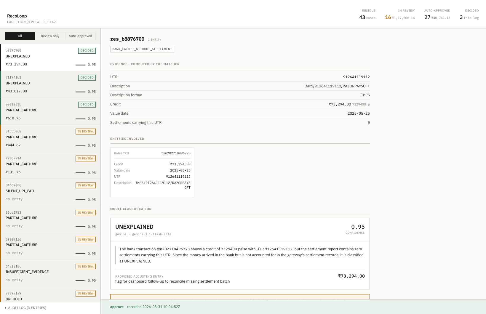
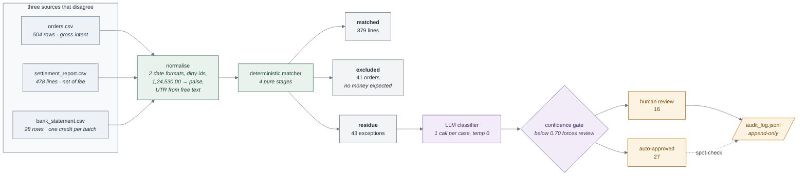

# RecoLoop — an AI finance controller for payment reconciliation

**Razorpay AI Buildathon · Track 04 · AI Finance Controller**

Closes one finance-ops loop over 500 synthetic records across three sources that
disagree by construction — the merchant's order ledger, the gateway's settlement
report, and the bank statement — and reports its match rate alongside the
exceptions it could not resolve.

**Design principle: the LLM never controls the matching path.** A deterministic
engine performs every financial join; the model only explains what that engine
could not resolve; a human authorizes anything that moves money.

| measure | value |
| --- | --- |
| defect capture | **40/40** |
| match rate by count / by value | **89.81% / 73.66%** |
| classifier accuracy | **37/40** (a structural ceiling — see [ARCHITECTURE.md](ARCHITECTURE.md)) |
| wrong auto-approvals | **0** |
| unreviewed exposure vs a rules baseline | **cut 82%** (₹2,21,709.87 → ₹40,741.13) |

## The exception queue



Cases the deterministic engine could not close, biggest money first inside the
bucket that needs a human. Each shows the matcher's computed evidence, the
entities involved, what it ruled out, and the model's proposed cause and
confidence — then approve, reject, or reclassify.

## The loop



Everything left of the classifier is deterministic, with no model anywhere in it;
everything right of the gate is a person. The model occupies exactly the middle —
it explains the 43 cases arithmetic could not close, and cannot approve any.

## Quickstart

```bash
npm install
npx tsx scripts/generate.ts      --seed 42 --orders 500 --defects 40
npx tsx scripts/verify.ts        --seed 42 --defects 40
npx tsx scripts/match.ts         --seed 42
npx tsx scripts/scoreMatch.ts    --seed 42
npx tsx scripts/scoreClassify.ts --seed 42
npm run dev                                    # the exception review UI
```

**No API key is needed for any of that** — generation, matching and scoring are
deterministic, and the classifier run they score is committed. To reproduce the
classifier, run `classify.ts --provider rules --fresh` offline, or add a key to
`.env` and use `--provider gemini`. `--fresh` is required to replace a run from a
different provider; without it the mismatch is refused rather than skipped.

## Why this is hard

A ₹1,000 card order settles at 2.00% fee plus 18% GST on that fee, crediting
**₹976.40** — a number that appears in no file. The bank shows **one credit for the
whole day's batch**, with a 12-digit UTR in free text as the only handle back:

```
NEFT CR-535865994834-RAZORPAY SOFTWARE PVT LTD    "44,735.78"
```

The inputs are dirty by design too: two date formats, ~8% of id cells carrying
stray whitespace and mixed case, and amounts as comma-grouped rupee strings that
must never touch a float.

## The dataset

500 orders over a 30-day window, every amount an integer number of paise, with
**40 seeded defects across 9 causal classes** — late settlements, prior-cycle
refunds, partial captures, fee variance, held batches, duplicate webhooks, silent
UPI failures, chargebacks and unexplained bank credits. Ground truth lives only in
`labels.json`, and a given `(seed, orders, defects)` triple produces
**byte-identical** files.

`scripts/verify.ts` reads it back as a consumer would and asserts ten independent
invariants — including that all 40 defects are recoverable from the CSVs alone,
and that no label data leaked into them.

## Results

**Matcher — 40/40 defect capture.** Every labelled defect reached residue; 802 of
959 clean records auto-matched (83.63%). Holds across 42 seeds and order counts
from 60 to 5,000.

**Classifier — 37/40, zero wrong auto-approvals.** Against a rules baseline that
scores the same 37/40, the model's contribution is routing: it sends 16 cases to
a human and cuts money proposed for booking without review from ₹2,21,709.87 to
₹40,741.13. All 6 matcher false positives were correctly declined.

37/40 is a **ceiling, not a miss**: three residue entries each carry two real
defects and `predicted_cause` holds one label. The model named the second defect
in its reasoning all three times and the schema discarded it — a contract defect,
logged as [FAILURES.md #4](FAILURES.md).

## Label isolation is a build failure, not a convention

`scripts/checkIsolation.ts` walks the static import graph from ten entry points —
matcher, classifier, both CLIs, every provider, the UI and its route — and fails
`npm run build` if any can reach the labels loader, `labels.json`, or the defect
taxonomy.

```
$ npm run build          # with an import of ../labels added to a matcher module
matcher isolation VIOLATED:
  src/lib/labels.ts: labels loader is reachable from the matcher
exit 1
```

That makes *"the model never saw the answers"* a provable property of the
codebase rather than a claim about how it happened to be run.

## Further reading

- **[ARCHITECTURE.md](ARCHITECTURE.md)** — how each stage works and why, the
  dataset contract, the measured classifier comparison, and what the confidence
  gate actually did.
- **[FAILURES.md](FAILURES.md)** — the four failures that changed a design
  decision: what broke, why, and what each one changed.
