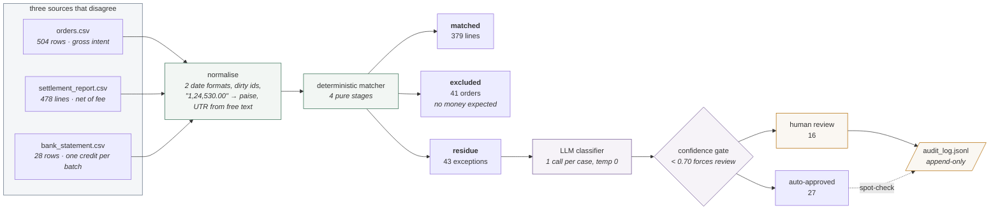

# RecoLoop — an AI finance controller for payment reconciliation

**Razorpay AI Buildathon · Track 04 · AI Finance Controller**

Closes one finance-ops loop over 500 synthetic records across three sources that
disagree by construction — the merchant's order ledger, the gateway's settlement
report, and the bank statement — and reports its match rate alongside the
exceptions it could not resolve.

**Design principle: the LLM never controls the matching path.** A deterministic
engine performs every financial join; the model only explains what that engine
could not resolve; a human authorizes anything that moves money.

| measure | value |
| --- | --- |
| defect capture | **40/40** |
| match rate by count / by value | **89.81% / 73.66%** |
| classifier accuracy | **37/40** (a structural ceiling — see [ARCHITECTURE.md](ARCHITECTURE.md)) |
| wrong auto-approvals | **0** |
| unreviewed exposure vs the rules baseline | **cut 82%** (₹2,21,709.87 → ₹40,741.13) |

## The loop



Everything left of the classifier is deterministic and has no model anywhere in
it. Everything right of the gate is a person. The model occupies exactly the
middle: it explains the 43 cases arithmetic could not close, and it cannot
approve any of them.

## Quickstart

```bash
npm install
npx tsx scripts/generate.ts      --seed 42 --orders 500 --defects 40
npx tsx scripts/verify.ts        --seed 42 --defects 40
npx tsx scripts/match.ts         --seed 42
npx tsx scripts/scoreMatch.ts    --seed 42
npx tsx scripts/scoreClassify.ts --seed 42
npm run dev                                    # the exception review UI
```

**No API key is needed for any of that.** Generation, matching and scoring are
deterministic, and the classifier run they score is committed, so the whole loop
— dataset through review UI — comes up on `npm install` alone.

To reproduce the classifier itself rather than score the committed run:

```bash
# offline deterministic baseline, no key (overwrites the committed Gemini run)
npx tsx scripts/classify.ts --seed 42 --provider rules --fresh

# or the model path: copy .env.example to .env, add a key, then
npx tsx scripts/classify.ts --seed 42 --provider gemini --fresh
```

`--fresh` is required to replace a run made by a different provider; without it
the mismatch is refused rather than silently skipped. To score the committed
rules baseline without overwriting anything, pass
`--file classifications.rules.jsonl` to the scorer.

Every script takes `--seed`, and `--out` / `--dir` to work outside `data/<seed>/`.

## Why this is hard

A ₹1,000 card order settles like this: the gateway takes 2.00% (₹20.00) plus 18%
GST on that fee (₹3.60) and credits **₹976.40**. Three of those four numbers
appear in no single file — and the bank statement never shows ₹976.40 at all. It
shows **one credit for the whole day's batch**, with a 12-digit UTR buried in
free text as the only handle back:

```
NEFT CR-535865994834-RAZORPAY SOFTWARE PVT LTD    "44,735.78"
```

Reconciliation is the work of proving that the ₹1,000 the merchant expected and
that batch credit are the same money. On top of that the inputs are dirty by
design: dates alternate between `DD/MM/YYYY` and `YYYY-MM-DD`, ~8% of id cells
carry stray whitespace and mixed case, and amounts arrive as comma-grouped rupee
strings that must never touch a float.

## The dataset

500 orders over a 30-day window, every amount an integer number of paise, with
**40 seeded defects across 9 causal classes**. Ground truth lives only in
`labels.json`, which nothing on the consuming side of the pipeline can read.

| cause | n | what it does to the data |
| --- | --- | --- |
| `LATE_SETTLEMENT` | 7 | settled `T+5` instead of `T+2`, two cycles from where it is expected |
| `REFUND_NETTED` | 6 | a refund from a **prior cycle** netted in; its parent payment is not in the dataset |
| `PARTIAL_CAPTURE` | 5 | captured less than the order asked for |
| `FEE_VARIANCE` | 5 | fee billed 0.4pp off the method's published slab |
| `ON_HOLD` | 4 | batch held — in the report, but **no bank credit exists at all** |
| `DUPLICATE_WEBHOOK` | 4 | one payment written to the ledger twice, ≤90s apart; only one settles |
| `SILENT_UPI_FAIL` | 4 | captured and settled, but the order is still `pending` |
| `CHARGEBACK_DEBIT` | 3 | an adjustment debit with no order or payment behind it |
| `UNEXPLAINED` | 2 | a bank credit whose UTR appears in no settlement |

`--defects N` rescales this distribution deterministically. Everything is seeded
from `mulberry32`: a given `(seed, orders, defects)` triple produces
**byte-identical** files every run.

`scripts/verify.ts` reads the dataset back the way a consumer would and asserts
ten independent invariants — including that all 40 defects are recoverable from
the CSVs alone, and that **no label data leaked into them**. It restates every
rate and constant independently of the generator, so a generator bug cannot hide
inside a helper both sides call.

## Results

**Matcher — 40/40 defect capture at seed 42.** Every labelled defect reached
residue. 802 of 959 clean records auto-matched (83.63%), 37 of 43 residue entries
contain a real defect. Holds across 42 seeds and order counts from 60 to 5,000
(at `--orders 5000`, capture is 120/120).

**Classifier — 37/40, zero wrong auto-approvals.** Against a deterministic rules
baseline that scores the same 37/40, the model's contribution is routing: it
sends 16 cases to a human and cuts money proposed for booking without review from
₹2,21,709.87 to ₹40,741.13, an 82% reduction at no cost in accuracy. All 6
matcher false positives were correctly declined as `INSUFFICIENT_EVIDENCE`.

37/40 is a **ceiling, not a miss**: three residue entries each carry two real
defects, and `predicted_cause` holds one label. The model named the second defect
in its reasoning in all three cases; the schema discarded it. That is a contract
defect, and it is [logged as defect 18](FAILURES.md).

## Label isolation is a build failure, not a convention

`src/lib/labels.ts` is the only module that reads `labels.json`.
`scripts/checkIsolation.ts` walks the static import graph from ten entry points —
the matcher, the classifier, both CLIs, every provider, the UI data module and
its route handler — and fails `npm run build` if any of them can reach the labels
loader, `labels.json`, or the defect taxonomy.

```
$ npm run build          # with an import of ../labels added to a matcher module
matcher isolation VIOLATED:
  src/lib/labels.ts: labels loader is reachable from the matcher
exit 1
```

That makes *"the model never saw the answers"* a provable property of the
codebase rather than a claim about how it happened to be run.

## Repository map

```
src/lib/            types · rng · money (integer paise) · dates · csv · ids
src/lib/generate.ts the generator          src/lib/defects.ts  defect taxonomy
src/lib/emit.ts     CSV rendering + dirt   src/lib/labels.ts   the ONLY labels reader

src/lib/normalize.ts        matcher stage 0
src/lib/match/              stages 1-4 (pure) + residue assembly
src/lib/match/run.ts        orchestration + all matcher I/O

src/lib/classify/schema.ts  Zod contract; both providers' schemas derive from it
src/lib/classify/prompt.ts  system prompt + per-case brief
src/lib/classify/           anthropic · gemini · rules providers, gate, retries

src/lib/ui/review.ts        UI data access (scanned by checkIsolation)
src/app/                    review UI: route handler, queue, evidence, decisions

scripts/                    generate · verify · match · classify · 2 scorers
scripts/checkIsolation.ts   build guard
```

## Further reading

- **[ARCHITECTURE.md](ARCHITECTURE.md)** — how each stage works and why, the
  dataset contract, the measured classifier comparison, and what the confidence
  gate actually did.
- **[FAILURES.md](FAILURES.md)** — all 19 defects found during construction, what
  caught each one, and what it cost.
